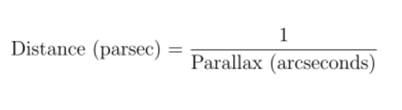
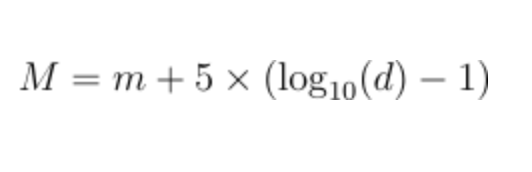
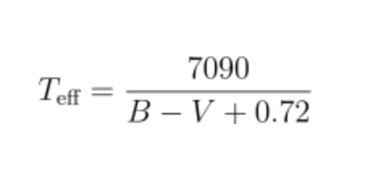
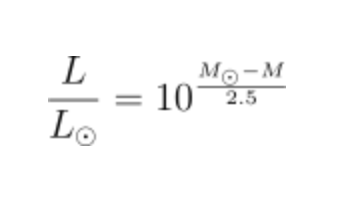
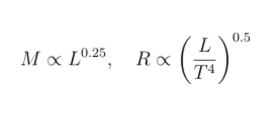

<!-- Header Image -->
<p align="center">
  
</p>


# **Stellar Classification Using Machine Learning** 🚀✨

Ever gazed up at the night sky and wondered if we could make sense of the countless stars scattered across the vast expanse of the cosmos? This project answers that question—by leveraging **machine learning** and **astrophysical theory** to build a star classification model that distinguishes between **dwarfs** and **giants** using data derived from **Kepler's space telescope** observations.

This project dives headfirst into the fusion of **machine learning** and **astronomy**, making star classification both powerful and captivating. By harnessing the explanatory power of **SHAP (SHapley Additive exPlanations)**, we break down how critical features—like temperature and luminosity—drive the model’s predictions. Coupled with an interactive **Flask API** for real-time predictions, this isn’t just another ML project—it’s a launchpad for exploring the cosmos. Whether you're an astrophysicist hunting for patterns or a space enthusiast eager to explore stellar mysteries, this project turns the night sky into your playground.


---

## **Project Directory Structure** 📂

Here’s how the project is structured to ensure modularity and scalability:

```bash
├── data
│   ├── dataset               # Cleaned and processed dataset derived from Kepler's database
├── notebooks
│   ├── star_classification.ipynb   # Jupyter notebook for detailed EDA and modeling
├── scripts
│   ├── data_processing.py    # Data preprocessing and feature engineering
│   ├── model_training.py     # Model training and evaluation scripts
│   ├── inference.py          # Inference script for making predictions
├── api
│   ├── app.py                # Flask API for real-time star classification
├── README.md                 # You’re reading it right now!
```

---

## **Motivation** 🌌

Stars are more than just twinkling dots in the sky. They’re **cosmic furnaces**, forging elements that make up the very fabric of life. Classifying stars helps astronomers better understand stellar evolution, galaxy formation, and even the potential for habitable planets.

This project was inspired by the **Harvard spectral classification system** and the **NASA Exoplanet program**, two pivotal contributions in astrophysics that help distinguish stars by their luminosity, temperature, and size. We sought to bring these principles into the world of machine learning by creating a model that can classify stars based on measurable features such as **parallax**, **visual magnitude**, and **color index**.

---

## **Theory Behind the Features** 🔭

Before diving into the ML workflow, let’s geek out on some **astrophysical concepts**:

### **1. Parallax (Plx)**
Parallax is the apparent shift in the position of a star when viewed from different vantage points on Earth. It’s crucial in determining the **distance** to nearby stars. Using the simple relation:

<p align="center">

</p>


we can convert the parallax angle into distance in **parsecs**, and further into **light-years** for intuitive understanding.

---

### **2. Absolute Magnitude (Amag)**
Stars can appear brighter or dimmer depending on their distance from us. To get a true measure of a star’s luminosity, we calculate its **absolute magnitude** using the formula:

<p align="center">

</p>

where:
- \(M\) is the absolute magnitude.
- \(m\) is the apparent visual magnitude.
- \(d\) is the distance in parsecs.

---

### **3. Effective Temperature (T)**

The **B-V color index** of a star is a reliable indicator of its surface temperature. Using an empirical relation:

<p align="center">

</p>

we can estimate the effective temperature of the star in **Kelvin**.

---

### **4. Luminosity (L)**
Luminosity is a measure of the total energy output of a star. Using the absolute magnitude, we calculate the luminosity relative to the Sun’s luminosity with:

<p align="center">

</p>

where M_dot is the Sun’s absolute magnitude (\(\approx 4.8\)).

---

### **5. Mass and Radius**
Stars on the **main sequence** obey well-known mass-luminosity and radius-luminosity relations. Using these, we estimate:

<p align="center">

</p>

---

## **Machine Learning Workflow** 🤖

### **Step 1: Data Preprocessing**
- Missing values were handled by dropping rows with insignificant percentages of missing data.
- Outliers were detected using the **interquartile range (IQR)** method and removed to improve model robustness.
- New features like **distance**, **absolute magnitude**, **temperature**, and **luminosity** were engineered using astrophysical formulas.

### **Step 2: Feature Engineering**
- Highly correlated features were identified through a **correlation matrix** and redundant ones were dropped to prevent multicollinearity.
- Log transformations were applied to skewed features to stabilize variance.
- Categorical features like **color type** were encoded using one-hot encoding.

### **Step 3: Model Selection**
We trained several models, including:
- **Logistic Regression**
- **Random Forest**
- **XGBoost**
- **LightGBM**
- **CatBoost**

Each model was evaluated using **accuracy**, **precision**, **recall**, and **F1 score**, with **LightGBM** emerging as the top performer after rigorous **hyperparameter tuning** using **GridSearchCV**.

#### - Model Performance
| Rank | Model                   | Accuracy  | Precision | Recall   | F1 Score |
|------|-------------------------|-----------|-----------|----------|----------|
| 6    | **LightGBM (Best)**     | **0.891363**  | **0.894188**  | **0.925750** | **0.909695** |
| 8    | Gradient Boosting       | 0.890715  | 0.896178  | 0.921909 | 0.908861 |
| 9    | CatBoost                | 0.890606  | 0.896018  | 0.921909 | 0.908780 |
| 0    | Logistic Regression     | 0.889958  | 0.896331  | 0.920263 | 0.908139 |
| 7    | XGBoost                 | 0.888228  | 0.895187  | 0.918435 | 0.906662 |
| 5    | AdaBoost                | 0.886283  | 0.888049  | 0.924104 | 0.905718 |
| 4    | Support Vector Machine  | 0.885850  | 0.888654  | 0.922458 | 0.905240 |
| 2    | Random Forest           | 0.884445  | 0.889775  | 0.918252 | 0.903789 |
| 3    | K-Nearest Neighbors     | 0.878500  | 0.887442  | 0.909839 | 0.898501 |
| 1    | Decision Tree           | 0.822289  | 0.845625  | 0.855523 | 0.850545 |

### **Step 4: Building the Flask API**
The trained LightGBM model was deployed using a simple **Flask API**. The API takes input parameters such as **parallax**, **visual magnitude**, and **color index**, and returns a prediction of whether the star is a **dwarf** or a **giant**.

---

## **How to Run the Project Locally** 🖥️

1. **Clone the Repository**
   ```bash
   git clone https://github.com/your-repo/star-classification.git
   cd star-classification
   ```

2. **Set Up a Virtual Environment**
   ```bash
   python -m venv env
   source env/bin/activate  # On Windows: env\Scripts\activate
   ```

3. **Install Dependencies**
   ```bash
   pip install -r requirements.txt
   ```

4. **Run the Flask API**
   ```bash
   cd api
   python app.py
   ```

5. **Test the API**
   Use a tool like **Postman** or **cURL** to send a POST request with star data and get predictions.

---

## **Future Work** 🌠

- Extend the model to classify more stellar types beyond dwarfs and giants.
- Incorporate additional data from **Gaia’s DR3** for more accurate feature engineering.
- Deploy the API using **Docker** and host it on **Heroku** or **AWS** for public access.

---

## **Credits and Acknowledgements** 🙌

- **NASA's Kepler Mission** for providing the raw stellar data.
- The scientific community behind **astrophysical relations** that made feature engineering possible.
  
---

---

## **Creator** 👨‍💻

If you’re curious about the project or want to collaborate, feel free to connect:

[](https://github.com/shubhupadhyay1)  
[](https://www.linkedin.com/in/shubh-upadhyay/)  
[](https://x.com/shubh_upadhyayy)

---

## **License** 📜

This project is licensed under the **MIT License**—go ahead, fork it, improve it, and explore the stars! 🌌

---


